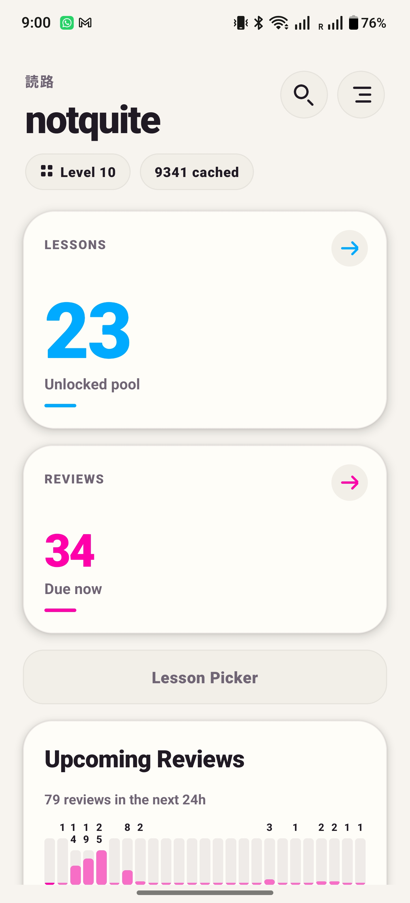
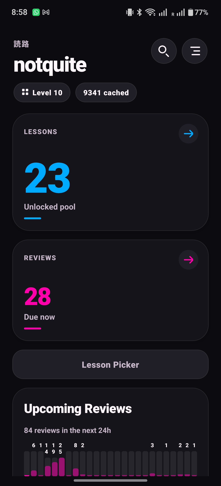

# 読路 (Yomiji)

A WaniKani study app for Android, built with React Native and Expo. Named for 読 (よ, reading) + 路 (じ, path): the reading path.

読路 is based on [Tsurukame](https://github.com/davidsansome/tsurukame), an unofficial WaniKani iOS app by David Sansome and contributors. Core domain logic — including the review state machine, answer checker, lesson flow, sync architecture, and settings — was derived from the Tsurukame Swift/UIKit source code in `tsurukame/`, with original flows and UI where the cross-platform app diverges. Tsurukame is licensed under the [Apache License 2.0](tsurukame/LICENSE).

The app name is 読路 (Yomiji); the onboarding hero also uses the kana/kanji wordmark 読み道 as a visual “reading road/path” motif.

See `ROADMAP.md` for the parity checklist, `USER_MANUAL.md` for feature-by-feature usage instructions, and `REACT_NATIVE_PORT_PRD.md` for historical product requirements context.

## Screenshots

| Light Mode | Dark Mode |
| --- | --- |
|  |  |

## Current Status

The app is an offline-first WaniKani client with a local SQLite cache, incremental sync, pending-write queues, error logging, working dashboard, lesson, review, and practice flows.

## Features

### Authentication

- WaniKani API token login validated against `/user`; the token must include review and study-material scopes.
- Secure token storage via platform Keychain/Keystore.
- After login, the dashboard prompts the user to sync WaniKani data before lessons, reviews, search, and subject details are available from the local cache.
- Logout clears token, local cache, pending queues, and scheduled review notifications.

### Data Sync

- Incremental sync using `updated_after` cursors for users, subjects, assignments, study materials, level progressions, voice actors, and review statistics.
- Pending-write queues for review progress, lesson starts, and study material edits, flushed to WaniKani when online.
- Battery-conscious lifecycle sync: incremental sync on foreground when stale (>15 min), pending-write flush on background only when writes exist, and pending-write flush before remote fetches.
- Manual pull-to-refresh for explicit incremental sync.
- Network-state awareness with actionable error messages for offline, timeout, auth, rate-limit, hibernating-account, and server errors.
- Auth error handling: 401/403 responses clear the stored token and prompt re-authentication.
- Rate-limit handling: 429 responses show retry timing from `Retry-After` header.
- Hibernating-account detection with actionable copy and link to wanikani.com.
- Sanitized error logging to local `error_log` table with token redaction.
- Manual full refresh from the diagnostics screen: clears all cached remote data and resyncs while preserving pending local writes.

### Dashboard

- First-sync panel for an empty local cache, with a **Sync WaniKani data** action before lessons, reviews, search, and subject details unlock.
- Username, level, and cache stats header.
- Available lessons count from the unlocked pool.
- Available reviews count based on current time.
- Upcoming reviews forecast chart showing review counts for the next 24 hours.
- Current-level progress bars for radicals, kanji, and vocabulary (passed/total).
- SRS bucket counts (Apprentice, Guru, Master, Enlightened, Burned) with progress bar.
- Recent mistakes section showing items answered incorrectly in the last 24 hours.
- Leeches section showing items with highest incorrect-to-correct ratio, with practice buttons.
- Shortcuts section with burned item practice (navigable) and excluded items browsing.
- Vacation mode banner.
- Sync status, last sync time, and error display.
- Lesson Picker button (visible when lessons are available).
- Immediate dashboard refresh when returning from review or lesson sessions.
- Hour-boundary refresh while foregrounded via AppState listener.

### Review Sessions

- Two-queue state machine (active queue + review queue) matching established iOS semantics.
- Wrong answers re-queued with a 5-item return delay.
- Per-item tracking of meaning/reading wrong counts.
- Items marked finished when both meaning and reading are answered, or one side is unavailable/skipped.
- Practice mode that never submits WaniKani SRS progress.
- Inline subject details after answer feedback with task-aware section hiding (meaning/reading sections hidden until attempted). Respects `showFullAnswer` setting.
- Mnemonic markup rendering for all WaniKani tag types (radical, kanji, vocabulary, reading, meaning, ja, jp, kan, bold/italic) with subject-type–colored highlights.
- Review summary with success rate and incorrect items grouped by level.
- For vocabulary, a **Play Audio** button appears after answer feedback and is disabled while offline.
- Wrap-up mode that stops adding new items and finishes only active items.

**Review Ordering** — Random, ascending SRS, descending SRS, alternating SRS, current level first, lowest level first, newest available, oldest available, longest relative wait.

**Answer Checking** — Normalization, romaji-to-kana conversion, meaning/reading validation, synonym support, blacklist checking, Levenshtein fuzzy matching, other-reading detection, invalid character range detection, okurigana mismatch detection, and exact-match mode.

**Cheats** — Override incorrect as correct, try again later (re-queue without penalty), and add synonym (queued for WaniKani API sync).

**Anki Mode** — Self-grading with immediate combined answer reveal (meaning and reading together on one card).

**Quick Settings** — Mid-session settings modal for toggling exact match, cheats, and full answer display without leaving the review. Includes Wrap Up and End Session actions. Changes persist to the main settings screen.

### Practice Modes

Practice sessions use the same review UI but never submit WaniKani SRS progress. Available from the dashboard:

- **Recent Mistakes** — Items answered incorrectly in the last 24 hours.
- **Apprentice Leeches** — Apprentice-stage items with the highest incorrect-to-correct ratio.
- **All Leeches** — All items with high incorrect-to-correct ratio, filtered by the configurable `leechThreshold` setting.
- **Burned Items** — Items at SRS stage 9 (Burned) for review practice.

### Lesson Sessions

- Fetches lesson-stage assignments from local cache with configurable ordering, filtering, session size, and quiz batch size.
- Ordering by level (ascending by default, or descending with current-level priority), then by subject type per `lessonOrder` setting (default: radical → kanji → vocabulary), then by subject ID.
- Interleave mode shuffles items within level groups for a mixed-type experience.
- Max lessons per session caps the dashboard Lessons card (default 15, configurable 1–50).
- New items per quiz controls how many subjects are introduced before each lesson quiz (default 5, configurable 1–10).
- Filters kana-only vocabulary when `showKanaOnlyVocab` is disabled.
- Filters hidden/excluded vocabulary based on study material data.

**Introduction Pages** — Each subject shows a detail page with meanings, readings, components/radicals, mnemonics (with inline Japanese rendering), context sentences (vocabulary), parts of speech (vocabulary), and "Used In" amalgamation chips. Navigate between subjects via chip bar or Back/Next buttons.

**Lesson Quiz** — After all introduction pages, a quiz phase uses the shared answer checker with meaning and reading prompts plus romaji-to-kana conversion. Cheats, Anki mode, and the Exact Match review setting are not applied during lesson quizzes. Lesson starts are queued for WaniKani API sync only after each subject is correctly answered in the quiz.

### Lesson Picker

- Browses up to 100 available lesson items grouped by level and subject type (radicals, kanji, vocabulary).
- Multi-select with checkmark toggles on each item.
- "Begin (N)" button passes selected items directly to the lesson session, bypassing the dashboard session cap and automatic ordering while still using quiz-sized batches.
- Respects the same kana-only and hidden/excluded filters as the lesson queue.

### Settings

**Appearance** — Light, dark, and system theme with immediate persistence.

**Lessons** — New items per quiz (1–10), max lessons per session (1–50), prioritize current level, interleave lessons, show kana-only vocabulary.

**Reviews** — Review order (9 options), Anki mode (combined card), exact match, group meaning & reading, meaning first, minimize review penalty, enable cheats, batch size (1–15), review count limit setting (5–500, step 5; currently bounded by a 100-item loaded queue) with enable/disable toggle, leech threshold.

**Subject Details** — Display onyomi readings in katakana, show all accepted alternate readings.

**Audio** — Streamed vocabulary pronunciation playback in reviews, manual playback after vocabulary answer feedback, optional autoplay after correct reading answers, background-audio interruption control, and preferred voice actor selection from synced WaniKani voice actors. Offline audio downloads are not implemented yet.

**Notifications** — Local notifications using a threshold + daily reminder model. A one-shot notification fires when the Nth future review becomes available (configurable threshold, default 50). An optional recurring daily reminder fires at a configured hour using a native DAILY trigger. Badge count reflects current available reviews; if review notifications are off but the badge icon is on, 読路 updates only the badge. Vacation mode suppresses all notifications and badges. Settings for notifications toggle, badging, sounds, review threshold (1–200), and daily reminder time (on/off with hour picker). Notification taps navigate to the review session.

**Diagnostics** — Cache stats, sync state/cursors, pending write counts, error log viewer, sanitized export via Share sheet, and full refresh (clear cache and resync).

**Log Out** — Clears token, cache, pending queues, and scheduled review notifications.

### Shared Components

- `ScreenLayout`, `SessionHeader` (with optional settings gear), `CenteredMessage` for consistent screen structure.
- `SubjectHeroCard` for displaying Japanese characters and radical images.
- `SrsBar` for SRS stage progress visualization.
- `ReviewQuickSettings` modal for in-session setting toggles.
- `SubjectDetailsContent` reusable component for rendering subject detail sections (meanings, readings, mnemonics, components, context sentences) in both standalone detail screens and inline in reviews.
- `TooltipPressable` and `ToastHost` for long-press help toasts on ambiguous icons and controls.
- CSS-aware SVG rendering for image-only radicals with inline style fallbacks.

### Accessibility and Help

- Long-press help toasts on dashboard level browse, search, settings, and session quick-settings controls.
- Accessibility labels and hints for icon-only buttons, lesson/review action cards, and numeric setting steppers.
- Decorative dots, accent marks, and arrow icons are hidden from assistive technology where adjacent text already conveys the meaning.

### Image-Only Radical Support

- WaniKani radicals that have no `characters` field are rendered using their `character_images` assets.
- Prefers PNG images; falls back to SVG with CSS variable resolution.
- Radical image diagnostics screen for previewing cached image-only radicals.

### Input

- In-app romaji-to-kana conversion for reading prompts.
- No reliance on OS Japanese keyboard switching.

### Subject Browsing and Search

- **SRS Bucket Browsing** — Tap any SRS bar row on the dashboard to browse all subjects in that bucket.
- **Level Catalog** — Browse subjects grouped by type (radical, kanji, vocabulary) at the current level, with navigation to detail screens.
- **Local Search** — Search by Japanese text, meaning, and kana reading prefixes. Exact matches sorted first, then prefix matches, then contains; ties broken by level ascending. Results limited to 50.
- **Rich Subject Detail** — Meanings, readings, component radicals/kanji with navigation, meaning and reading mnemonics with inline Japanese rendering, hints, context sentences, parts of speech, "Used In" amalgamation chips, SRS stage, and review accuracy percentage.
- **Meaning Synonyms** — Existing meaning synonyms are shown and accepted during reviews. New synonyms can currently be added from the review cheat **Add as synonym** after an incorrect meaning answer.
- **Note Editing** — Add/edit meaning and reading notes, queued for WaniKani API sync.

### Testing

- Unit tests for answer checking (normalization, fuzzy matching, blacklists, okurigana, other readings).
- Unit tests for romaji-to-kana conversion.
- Unit tests for review session state machine (ordering, grouping, wrap-up, wrong counts, practice mode).
- Unit tests for study repository queries and radical SVG/image handling.
- Unit tests for error sanitization, sync error classification, and friendly message generation.
- Unit tests for migration schema validation (version ordering, table/index completeness, constraints).
- Unit tests for lesson selection filtering and ordering (kana-only, hidden, level, subject type, interleave).
- Unit tests for leech score calculation and dashboard repository logic.
- Integration tests for subject search ranking (exact/prefix/contains matching, level tie-breaking, subject-type sort, limit, case insensitivity).
- Integration tests for notification scheduling (threshold triggers, daily DAILY triggers, badge-only mode, vacation suppression, legacy notification cleanup, badge count not set on notification content).
- Integration tests for clearReviewNotifications (cancels known IDs and resets badge).
- Integration tests for WaniKani API pagination and `updated_after` cursors.
- Integration tests for sync service incremental cursors and pending-write flush (reviews, lessons, study materials).

## Known Major Gaps

- Dashboard lacks WaniKani recommended lessons vs. advanced lesson pool separation. Algorithm research is complete (see `docs/recommended-lessons-research.md`); implementation pending.
- Offline audio downloads are not implemented.
- The `yomiji://` custom scheme is reserved in app config, but deep-link route parsing and universal/app links are not implemented.
- Custom font and font-size settings are not implemented.
- Katakana practice is not planned.

## Getting Started

Requirements: Node 22, pnpm 9, Java 17, Android SDK/Emulator, and Expo/EAS-compatible credentials for release work. `pnpm start` uses `expo start --dev-client`, so install/run a development build first with `pnpm android`.

```sh
pnpm install
pnpm android     # expo run:android (creates/runs a development build)
pnpm start       # expo start --dev-client
```

## Commands

```sh
pnpm typecheck                     # tsc --noEmit
pnpm test                          # jest --runInBand
pnpm start                         # expo start --dev-client
pnpm android                       # expo run:android
pnpm ios                           # expo run:ios
pnpm web                           # expo start --web (experimental/unsupported)
pnpm version:bump [patch|minor|major]  # update package/app versions, commit, and tag
pnpm exec expo install --check
```

Use `pnpm` for dependency changes. Keep `pnpm-lock.yaml` current.

## Release

- Run `pnpm typecheck` and `pnpm test` locally before release.
- Version source of truth is `package.json` + `app.json`; EAS is configured with remote app version source and production auto-increment, so use `pnpm version:bump [patch|minor|major]` rather than editing native Gradle version fields directly.
- `pnpm version:bump` updates `package.json` and `app.json`, increments Android `versionCode` and iOS `buildNumber`, commits `Release vX.Y.Z`, and creates an annotated `vX.Y.Z` tag.
- Push with `git push --follow-tags origin main`. The Android Release workflow runs on `v*` tags or manual dispatch.
- CI installs pnpm 9, Node 22, and Java 17; runs install/typecheck/tests; builds a production APK with `eas build --platform android --profile production --local --output build.apk`; verifies the APK signature; and publishes `build.apk` to a GitHub Release.
- Required GitHub secrets: `EXPO_TOKEN`, `YOMIJI_KEYSTORE_BASE64`, and `YOMIJI_KEYSTORE_PASSWORD`. The release key alias is `yomiji`.
- Release builds fail closed if signing material is missing; debug signing is only for local debug builds.

## Project Structure

```
src/
  domain/           # Pure logic layer — no React, no UI imports
    answers/        # Answer checking, romaji-to-kana conversion
    api/            # WaniKani v2 REST client (WaniKaniClient.ts) + types
    audio/          # Vocabulary pronunciation audio selection and streaming playback
    db/             # SQLite open/migrations/put functions (database.ts, schema.ts, errorLog.ts, subjectRepository.ts, assignmentRepository.ts, studyMaterialRepository.ts)
    dashboard/      # Dashboard query aggregation
    notifications/  # Threshold + daily reminder scheduling, badge management, Expo Go shim
    settings/       # AppSettings, load/save via AsyncStorage
    storage/        # Secure token storage (expo-secure-store)
    study/          # Review/lesson queue queries, result queueing, ordering, filtering
    subjects/       # Radical image handling and SVG rendering
    sync/           # Incremental sync + pending-write flush (syncService.ts)
  navigation/       # React Navigation routes, auth gate, AppState lifecycle
  screens/          # UI screens (Dashboard, Login, Settings, Diagnostics, ReviewSession, LessonSession, LessonPicker, RadicalImagePreview, SubjectCatalog, SubjectSearch, SubjectBrowse, SubjectDetail)
  components/       # Shared UI components (ScreenLayout, SubjectHeroCard, SubjectDetailsContent, SrsBar, ReviewQuickSettings, ReviewForecastChart, LevelProgressChart, DashboardItemList)
  theme/            # WaniKani color palette, subject-type colors, theme provider
scripts/            # Release tooling (version-bump.sh)
App.tsx             # App root
tsurukame/          # Original iOS Swift/UIKit source — behavior reference only
```
