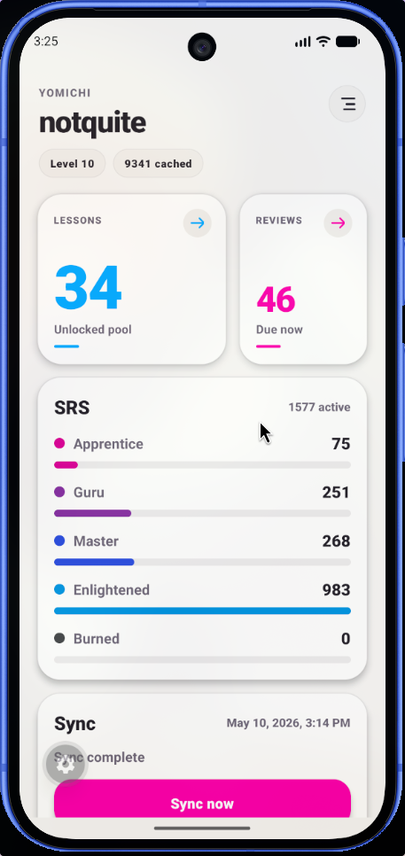
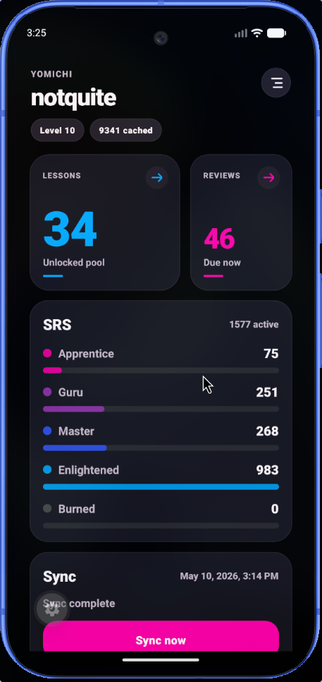

# 読路 (Yomiji)

A WaniKani study app for Android, built with React Native and Expo. Named for 読 (よ, reading) + 路 (じ, path): the reading path.

読路 is based on [Tsurukame](https://github.com/davidsansome/tsurukame), an unofficial WaniKani iOS app by David Sansome and contributors. Core domain logic — including the review state machine, answer checker, lesson flow, sync architecture, and settings — was derived from the Tsurukame Swift/UIKit source code in `tsurukame/`, with original flows and UI where the cross-platform app diverges. Tsurukame is licensed under the [Apache License 2.0](tsurukame/LICENSE).

See `ROADMAP.md` for the parity checklist and `REACT_NATIVE_PORT_PRD.md` for historical product requirements context.

## Screenshots

| Light Mode | Dark Mode |
| --- | --- |
|  |  |

## Current Status

The app is an offline-first WaniKani client with a local SQLite cache, incremental sync, pending-write queues, error logging, and working dashboard, lesson, and review flows.

## Features

### Authentication

- WaniKani API token login validated against `/user`.
- Secure token storage via platform Keychain/Keystore.
- Logout clears token, local cache, and pending queues.

### Data Sync

- Incremental sync using `updated_after` cursors for users, subjects, assignments, study materials, level progressions, voice actors, and review statistics.
- Pending-write queues for review progress, lesson starts, and study material edits, flushed to WaniKani when online.
- Battery-conscious lifecycle sync: full sync on foreground when stale (>15 min), pending-write flush on background only when writes exist.
- Manual pull-to-refresh for explicit full sync.
- Network-state awareness with actionable error messages for offline, timeout, auth, rate-limit, hibernating-account, and server errors.
- Auth error handling: 401/403 responses clear the stored token and prompt re-authentication.
- Rate-limit handling: 429 responses show retry timing from `Retry-After` header.
- Hibernating-account detection with actionable copy and link to wanikani.com.
- Sanitized error logging to local `error_log` table with token redaction.
- Manual full refresh: clears all cached remote data while preserving pending local writes, available from diagnostics screen.

### Dashboard

- Username, level, and cache stats header.
- Available lessons count from the unlocked pool.
- Available reviews count based on current time.
- Upcoming reviews forecast chart showing review counts for the next 24 hours.
- Current-level progress bars for radicals, kanji, and vocabulary (passed/total).
- SRS bucket counts (Apprentice, Guru, Master, Enlightened, Burned) with progress bar.
- Recent mistakes section showing items answered incorrectly in the last 24 hours.
- Leeches section showing items with highest incorrect-to-correct ratio.
- Shortcuts section with burned item practice count and excluded items count.
- Vacation mode banner.
- Sync status, last sync time, and error display.
- Lesson Picker button (visible when lessons are available).
- Immediate dashboard refresh when returning from review or lesson sessions.
- Hour-boundary refresh while foregrounded via AppState listener.

### Review Sessions

- Two-queue state machine (active queue + review queue) matching established iOS semantics.
- Wrong answers re-queued with a 5-item return delay.
- Per-item tracking of meaning/reading wrong counts.
- Items marked finished when both meaning and reading are answered, or one side is unavailable/skipped.
- Practice mode that never submits WaniKani SRS progress.
- Review summary with success rate and incorrect items grouped by level.
- Wrap-up mode that stops adding new items and finishes only active items.

**Review Ordering** — Random, ascending SRS, descending SRS, alternating SRS, current level first, lowest level first, newest available, oldest available, longest relative wait.

**Answer Checking** — Normalization, romaji-to-kana conversion, meaning/reading validation, synonym support, blacklist checking, Levenshtein fuzzy matching, other-reading detection, invalid character range detection, okurigana mismatch detection, and exact-match mode.

**Cheats** — Override incorrect as correct, try again later (re-queue without penalty), and add synonym (queued for WaniKani API sync).

**Anki Mode** — Self-grading with immediate answer reveal. Supports both, reading-only, meaning-only, and combined reading/meaning variants.

**Quick Settings** — Mid-session settings modal for toggling exact match, cheats, Anki mode, answer reveal, and full answer display without leaving the review. Includes Wrap Up and End Session actions. Changes persist to the main settings screen.

### Lesson Sessions

- Fetches lesson-stage assignments from local cache with configurable ordering, filtering, session size, and quiz batch size.
- Ordering by level (ascending by default, or descending with current-level priority), then by subject type per `lessonOrder` setting (default: radical → kanji → vocabulary), then by subject ID.
- Interleave mode shuffles items within level groups for a mixed-type experience.
- Max lessons per session caps the dashboard Lessons card (default 15, configurable 1–50).
- New items per quiz controls how many subjects are introduced before each lesson quiz (default 5, configurable 1–10).
- Filters kana-only vocabulary when `showKanaOnlyVocab` is disabled.
- Filters hidden/excluded vocabulary based on study material data.

**Introduction Pages** — Each subject shows a detail page with meanings, readings, components/radicals, mnemonics (with inline Japanese rendering), context sentences (vocabulary), parts of speech (vocabulary), and "Used In" amalgamation chips. Navigate between subjects via chip bar or Back/Next buttons.

**Lesson Quiz** — After all introduction pages, a quiz phase uses the same answer-checking UI as reviews. Answer checking supports meaning and reading prompts with romaji-to-kana conversion. Lesson starts are queued for WaniKani API sync only after each subject is correctly answered in the quiz.

### Lesson Picker

- Browses all available lesson items grouped by level and subject type (radicals, kanji, vocabulary).
- Multi-select with checkmark toggles on each item.
- "Begin (N)" button passes selected items directly to the lesson session, bypassing the dashboard session cap and automatic ordering while still using quiz-sized batches.
- Respects the same kana-only and hidden/excluded filters as the lesson queue.

### Settings

**Appearance** — Light, dark, and system theme with immediate persistence.

**Lessons** — New items per quiz (1–10), max lessons per session (1–50), prioritize current level, interleave lessons, show kana-only vocabulary.

**Reviews** — Review order (9 options), Anki mode, exact match, group meaning & reading, meaning first, minimize review penalty, enable cheats, skip kanji readings, batch size (1–15), review count limit with configurable cap.

**Diagnostics** — Cache stats, sync state/cursors, pending write counts, error log viewer, sanitized export via Share sheet, and full refresh (clear cache and resync).

**Log Out** — Clears token, cache, and pending queues.

### Shared Components

- `ScreenLayout`, `SessionHeader` (with optional settings gear), `CenteredMessage` for consistent screen structure.
- `SubjectHeroCard` for displaying Japanese characters and radical images.
- `SrsBar` for SRS stage progress visualization.
- `ReviewQuickSettings` modal for in-session setting toggles.
- `TooltipPressable` and `ToastHost` for long-press help toasts on ambiguous icons and controls.
- CSS-aware SVG rendering for image-only radicals with inline style fallbacks.

### Accessibility and Help

- Long-press help toasts on dashboard level browse, search, settings, and session quick-settings controls.
- Accessibility labels and hints for icon-only buttons, lesson/review action cards, and numeric setting steppers.
- Decorative dots, accent marks, and arrow icons are hidden from assistive technology where adjacent text already conveys the meaning.

### Image-Only Radical Support

- WaniKani radicals that have no `characters` field are rendered using their `character_images` assets.
- Prefers PNG images; falls back to SVG with CSS variable resolution.
- Radical image diagnostics screen for previewing cached image-only radicals.

### Input

- In-app romaji-to-kana conversion for reading prompts.
- No reliance on OS Japanese keyboard switching.

### Subject Browsing and Search

- **Level Catalog** — Browse subjects grouped by type (radical, kanji, vocabulary) at the current level, with navigation to detail screens.
- **Local Search** — Search by Japanese text, meaning, and kana reading prefixes. Exact matches sorted first, then prefix matches, then contains; ties broken by level ascending. Results limited to 50.
- **Rich Subject Detail** — Meanings, readings, component radicals/kanji with navigation, meaning and reading mnemonics with inline Japanese rendering, hints, context sentences, parts of speech, "Used In" amalgamation chips, SRS stage, and review accuracy percentage.
- **Synonym Editing** — Add/remove meaning synonyms, queued for WaniKani API sync via pending writes.
- **Note Editing** — Add/edit meaning and reading notes, queued for WaniKani API sync.

### Testing

- Unit tests for answer checking (normalization, fuzzy matching, blacklists, okurigana, other readings).
- Unit tests for romaji-to-kana conversion.
- Unit tests for review session state machine (ordering, grouping, wrap-up, wrong counts, practice mode).
- Unit tests for study repository queries and radical SVG/image handling.
- Unit tests for error sanitization, sync error classification, and friendly message generation.
- Unit tests for migration schema validation (version ordering, table/index completeness, constraints).
- Unit tests for lesson selection filtering and ordering (kana-only, hidden, level, subject type, interleave).
- Unit tests for leech score calculation and dashboard repository logic.
- Unit tests for search result ranking (exact, prefix, contains match ordering).

## Known Major Gaps

- Dashboard has upcoming reviews chart, current-level progress, recent mistakes, leeches, and shortcuts.
- Dashboard lacks WaniKani recommended lessons vs. advanced lesson pool separation.
- Subject catalog by level, local search, and rich detail screen are implemented. SRS browsing, remaining items, and excluded items screens are not yet wired.
- Audio playback, offline audio, and voice actor selection are not implemented.
- Notifications, badges, and deep links are not implemented.
- Custom font and font-size settings are not implemented.
- Quick settings during review is implemented. Hardware keyboard shortcuts are not planned.
- Diagnostics screen is implemented. Audio, font, and notification settings UI are not yet exposed.

## Getting Started

```sh
pnpm install
pnpm start
pnpm android
```

## Commands

```sh
pnpm typecheck             # tsc --noEmit
pnpm test                  # jest --runInBand
pnpm start                 # expo start
pnpm android               # expo start --android
pnpm ios                   # expo start --ios
pnpm exec expo install --check
```

Use `pnpm` for dependency changes. Keep `pnpm-lock.yaml` current.

## Project Structure

```
src/
  domain/           # Pure logic layer — no React, no UI imports
    answers/        # Answer checking, romaji-to-kana conversion
    api/            # WaniKani v2 REST client (WaniKaniClient.ts) + types
    db/             # SQLite open/migrations/put functions (database.ts, schema.ts, errorLog.ts, subjectRepository.ts, assignmentRepository.ts, studyMaterialRepository.ts)
    dashboard/      # Dashboard query aggregation
    settings/       # AppSettings, load/save via AsyncStorage
    storage/        # Secure token storage (expo-secure-store)
    study/          # Review/lesson queue queries, result queueing, ordering, filtering
    subjects/       # Radical image handling and SVG rendering
    sync/           # Incremental sync + pending-write flush (syncService.ts)
  navigation/       # React Navigation routes, auth gate, AppState lifecycle
  screens/          # UI screens (Dashboard, Login, Settings, Diagnostics, ReviewSession, LessonSession, LessonPicker, RadicalImagePreview, SubjectCatalog, SubjectSearch, SubjectDetail)
  components/       # Shared UI components (ScreenLayout, SubjectHeroCard, SrsBar, ReviewQuickSettings, ReviewForecastChart, LevelProgressChart, DashboardItemList)
  theme/            # WaniKani color palette, subject-type colors, theme provider
App.tsx             # App root
tsurukame/          # Original iOS Swift/UIKit source — behavior reference only
```
